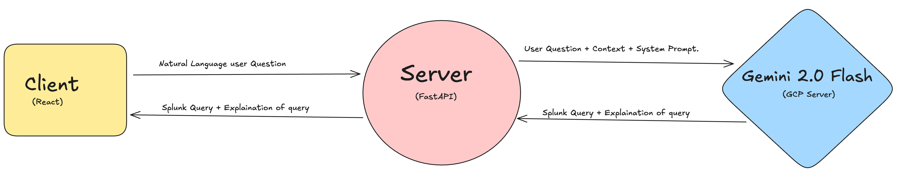

Okay, let's update the `README.md` to include the project structure and instructions based on the `CodeJam` root directory, and add a section for the workflow diagram image.

```markdown
# 🧠 SPL Query Assistant - CodeJam Project

## ✨ Overview

This project is a web application developed during a CodeJam event. Its primary function is to act as an intelligent assistant for Splunk users. It allows users to enter complex search requirements in natural language (plain English), and the backend, powered by a Large Language Model, translates that request into a valid Splunk Search Processing Language (SPL) query, providing a clear explanation of the generated query.

## 🚀 Features

*   **Natural Language to SPL Conversion:** Easily translate your search needs from human language into precise SPL syntax.
*   **SPL Query Explanation:** Get a detailed breakdown of the generated SPL query, helping you understand each command and its purpose.
*   **Intuitive Web Interface:** A simple and clean user interface to input your queries and view the results.
*   **Intelligent Backend:** Utilizes Google Gemini Flash 2.0 combined with RAG (Retrieval Augmented Generation) and Few-Shot Learning techniques for accurate and relevant query generation.

## **Project Structure** 🗂️

```
CodeJam/
├── backend/             # FastAPI application
│   ├── requirements.txt # Python dependencies
│   ├── main.py          # FastAPI entry point (or similar)
│   ├── .env             # Environment variables (e.g., API key)
│   └── ... other backend files
├── frontend/            # React application
│   ├── package.json     # Node.js dependencies
│   ├── src/             # React source files
│   ├── public/          # Public assets
│   └── ... other frontend files
├── docs/                # Optional: Directory for documentation/images
│   └── images/
│       └── workflow.png # High-level workflow diagram image
├── .gitignore           # Specifies intentionally untracked files
├── LICENSE              # License file
└── README.md            # This file
```

## 🏗️ Architecture

The application follows a standard client-server architecture:

*   **Frontend (React + Tailwind 4):** Provides the user interface for interacting with the assistant. It sends natural language queries to the backend and displays the generated SPL and explanation.
*   **Backend (FastAPI):** Serves as the API layer. It receives the natural language query from the frontend, processes it using the LLM, and returns the generated SPL query and its explanation.
*   **LLM (Google Gemini Flash 2.0):** The core intelligence engine responsible for generating the SPL based on the natural language input.
*   **RAG & Few-Shot Learning:** Techniques used within the backend to provide the LLM with relevant context (e.g., Splunk documentation examples, common SPL patterns) to improve the quality and accuracy of the generated queries.

```mermaid

```

## ▶️ High-Level Workflow

This diagram illustrates the main flow of a user query through the application:



*(**Note:** Please place the actual workflow image file in the `docs/images/` directory as referenced above)*

## 🛠️ Tech Stack

*   **Frontend:**
    *   React
    *   Tailwind CSS 4
    *   npm / yarn
*   **Backend:**
    *   FastAPI
    *   Python 3.7+
    *   Libraries for interacting with Google Gemini API (e.g., `google-generativeai`)
    *   Libraries for RAG context (e.g., handling text data, potentially vector stores if implemented deeply)
*   **AI/LLM:**
    *   Google Gemini Flash 2.0

## ⚙️ Installation and Setup

To run this project locally, you need to set up both the backend and the frontend.

### Prerequisites

*   Node.js and npm (or yarn) installed
*   Python 3.7+ and pip installed
*   An API key for Google Gemini (Gemini Flash 2.0). You can obtain one from [Google AI Studio](https://aistudio.google.com/).

### Steps

1.  **Clone the repository:**
    ```bash
    git clone <repository_url>
    cd CodeJam
    ```
    *(Replace `<repository_url>` with the actual URL of your repository)*

2.  **Frontend Setup:**
    *   Navigate into the frontend directory:
        ```bash
        cd frontend
        ```
    *   Install the required Node.js packages:
        ```bash
        npm install # or yarn install
        ```
    *   (Optional) If your backend is not running on the default `http://localhost:8000`, you might need to configure the frontend's API endpoint.

3.  **Backend Setup:**
    *   Navigate back to the root directory and then into the backend directory:
        ```bash
        cd ../backend
        ```
    *   (Optional but recommended) Create and activate a Python virtual environment:
        ```bash
        python -m venv venv
        source venv/bin/activate  # On Windows use `.\venv\Scripts\activate`
        ```
    *   Install the required Python packages:
        ```bash
        pip install -r requirements.txt
        ```
        *(Make sure you have a `requirements.txt` file in the `backend` directory listing all dependencies)*
    *   Create a `.env` file in the `backend` directory to store your API key:
        ```env
        GEMINI_API_KEY=YOUR_GEMINI_API_KEY
        ```
        *(Replace `YOUR_GEMINI_API_KEY` with your actual API key)*

4.  **Run the Application:**
    *   **Start the Backend:**
        Open a terminal, navigate to the `backend` directory (`cd CodeJam/backend`), activate the virtual environment (if you created one), and run the FastAPI server:
        ```bash
        uvicorn main:app --reload
        ```
        The backend should start and be accessible, typically at `http://localhost:8000`.
    *   **Start the Frontend:**
        Open *another* terminal, navigate to the `frontend` directory (`cd CodeJam/frontend`), and start the React development server:
        ```bash
        npm start # or yarn start
        ```
        The frontend should open in your default web browser at `http://localhost:3000`.

## 💡 Usage

1.  Once both the backend and frontend are running, open your web browser to `http://localhost:3000`.
2.  You will see a text area where you can type your natural language query describing the Splunk search you want to perform (e.g., "Find all failed login attempts from IP address 192.168.1.10 in the last 24 hours").
3.  Click the "Generate SPL" or similar button.
4.  The application will display the generated SPL query and a detailed explanation of what the query does.

## ⏭️ Future Enhancements

*   Allow users to provide feedback on the generated queries.
*   Integrate with a live Splunk instance to test queries directly.
*   Expand the RAG corpus with more extensive Splunk documentation and use cases.
*   Improve handling of complex time ranges and data models.
*   Add support for saving and managing past queries.
*   Implement user authentication.

